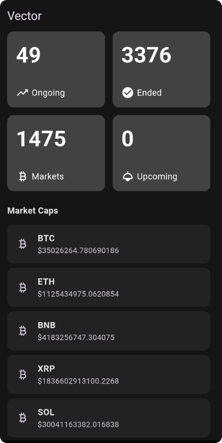

<!-- # > **Vector** -->
 

  Vector

  

<h1 align="center"></h1>

The purpose of this project is to showcase production grade, senior-level Flutter engineering.

Vector is a highly scalable Flutter project. It follows **Clean Architecture**, uses a **monorepo setup with Melos**, and incorporates best practices. I believe this is how large-scale applications should be structured.

## TLDR;

     ─ CLEAN Architecture, with BLOC + Cubit
     ─ getIt for Dependency Injection, with Injectable
     ─ Monorepo pattern with Melos (highly scalable)
     ─ CI/CD with Github
     ─ Unit testing
       
##  Screenshot

  

## 🛡 Clean Architecture

Vector follows a strict unidirectional data flow:

1.  **Presentation Layer**: BLoC/Cubit for state management, following the `very_good_analysis` linting rules.
    
2.  **Domain Layer**: Pure Dart logic. No Flutter dependencies.
    
3.  **Data Layer**: Responsible for data fetching.

**Key Goals**: Separation of concerns, Testability, Scalability, Maintainability

## 📦 Monorepo Setup

I have set up a multiple packages architecture with the help of **Melos**.

### Structure:

    vector/
    ├── apps/        	   # holds all the apps
    │   └── vector/        # main Flutter application
    ├── packages/
    │   └── domain/        # pure Dart
    │   └── data/          # handles data layer
    │   └── core/          # has config and other necessary classes
    ├── pubspec.yaml

**Benefits:**
-   Independent package development
-   Easier scaling for large apps

## 📦 Github CI/CD

I have implemented a CI/CD with Github Workflows. I have automated this on every PR -

**Lints**: Enforcement of `very_good_analysis`
 **Formatting**: `dart format` check to ensure codebase consistency.
 **Tests**: Runs the available Unit and Widget tests

## 📝 Author

**Rahat Iqbal,**  _Software Engineer with 4.5+ years of experience in building scalable mobile applications.
**GitHub**: [@Rahat-Iqbal-git](https://github.com/Rahat-Iqbal-git)_
***Linkedin***: [@RahatIqbal](https://www.linkedin.com/in/rahat-iqbal-81b4771bb/)
